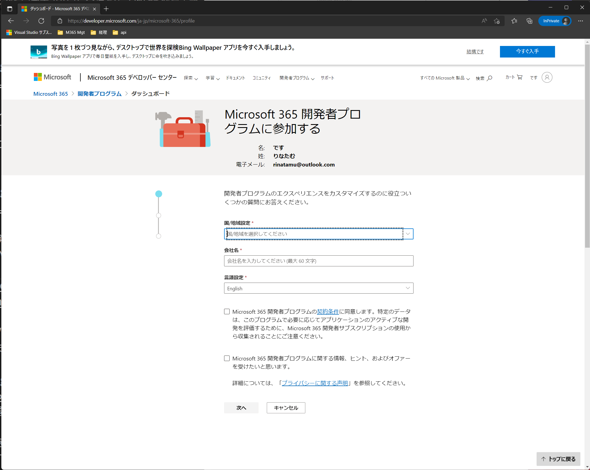

# Microsoft 365 開発者プログラム 登録方法

---

Microsoft 365 の開発者プログラムは、Microsoft 365 E5 相当のライセンスを、25ユーザー分、開発目的に利用することができます。

90日間利用することができ、90日毎に利用状況を審査され、問題なければ、更に90日間自動延長されます。
審査に落ちた場合は、その時点で終了となり、環境が消えてしまいます。

ですので、開発目的での利用に限って使用しましょう。

## 前提条件

Microsoft 365 開発者プログラムを登録するには、Microsoft アカウントが必要です。

お持ちでない方は、以下のURLからアクセスして、作成しましょう。

URL:https://outlook.live.com/owa/

## 本環境を使用する際は Microsoft Edge の InPrivate ブラウズ機能を使用してください。

会社のアカウントで普段使用しているブラウザモードで使用すると、認証情報が重複して、うまく動作しないことがあります。
以下の手順に従って、InPrivate ブラウズモードのブラウザを起動して作業を行ってください。

1. Microsoft Edge を起動します。

2. ウィンドウ右上にある「…」のアイコン（メニューアイコン）をクリックします。

3. メニューが開きますので、「新しい InPrivateウィンドウ」をクリックします。

4. 以下のように、InPrivate ブラウズモードのブラウザが起動します。

5. このブラウザの中で各種操作を行ってください。

## 作成手順

1. [Microsoft 365 開発者プログラム](https://developer.microsoft.com/ja-jp/microsoft-365/dev-program)にアクセスします。

URL:https://developer.microsoft.com/ja-jp/microsoft-365/dev-program

2. 「今すぐ参加」をクリックします。

3. Microsoft アカウントを使ってサインインします

※会社のメールアドレスではなく、個人のプライベートアドレスです。

4. サインインすると、以下のような画面が表示されます。シークレットモードの場合は下記のように英語標記となる場合があります。

英語表記となった場合は、以下のURLを使用してください。

URL:https://developer.microsoft.com/ja-jp/microsoft-365/profile

下図の通り、日本語表記になったことを確認します。

5. 国・地域 /会社名 / 言語設定 をそれぞれ入力します

※会社名は適当で大丈夫です。

6. 契約条件を確認し、問題なければチェックを入れます。

7. 「次へ」をクリックします。

8. 開発者としての主な目的を選択し、「次へ」をクリックします。

9. 興味ある分野にチェックを入れ、「保存」をクリックします。

10. Microsoft 365 開発者プログラムのダッシュボードが表示された場合は、「E5 サブスクリプションのセットアップ」をクリックします。

11. サンドボックスタイプを選択し、「次へ」をクリックします。

インスタントサンドボックスを選択した場合は、ランダムなドメインで作成され、サンプルデータなどが含まれます。
また、比較的早く作成されるので、学習には最適なタイプです。

構成可能なサンドボックスの場合は、ドメイン名を手動で指定することができますが、作成時間がかかるのとサンプルデータを自分で作る必要があります。

### インスタントサンドボックスを選択した場合

12. インスタントサンドボックスを選択した場合は、データセンターの場所、管理者ユーザー名、パスワードを以下のルールで指定し、「続行」をクリックします

ユーザー名
　→半角英字のみ
管理者パスワード
　→数字・英字（大文字・小文字）・記号　この組み合わせが必要でかつ15文字以上

※テストユーザーのパスワードを変えたい場合は、代替パスワードの使用にチェックを入れて、代替パスワードを指定してください。

### 構成可能なサンドボックスを選択した場合

13. 構成可能なサンドボックスを選択した場合は、国と、ユーザー名、ドメイン、パスワードを指定し、「続行」をクリックします。

なお、ドメインは世界で一意（一つ）のものとなりますので、ほかのドメインがすでに使われているとこのように表示されます。

警告文が、一見すると使用できそうなニュアンスで表示されますが、続行ボタンが押せませんので使用できません。
ほかのドメイン名を指定してください。

14. SMS（ショートメッセージ）が使用可能な個人の電話番号の入力を求められますので、適宜入力し、「コードの送信」をクリックします。

15. 項番14で入力した電話番号にSMSでコードを受信しますので、画面上に入力し、「設定」をクリックします。

16. 作成されると以下のようなメールをMicrosoft アカウントにて受信します。

17. Microsoft 365 Developer Program dashboard をクリックします

URL:https://developer.microsoft.com/ja-jp/microsoft-365/profile

18. 項番3で使用した Microsoft アカウントを使用してサインインします。

19. 作成したドメインが表示されていますので、「サブスクリプションに移動する」をクリックします

20. 項番12 もしくは 13 に指定したパスワードを使ってサインインします。

21. 以下のような表示がされた場合は、「今はしない」をクリックします。

22. サインインの状態を維持しますか？には、「はい」をクリックします。

23. Microsoft 365 が使用できるようになります。

