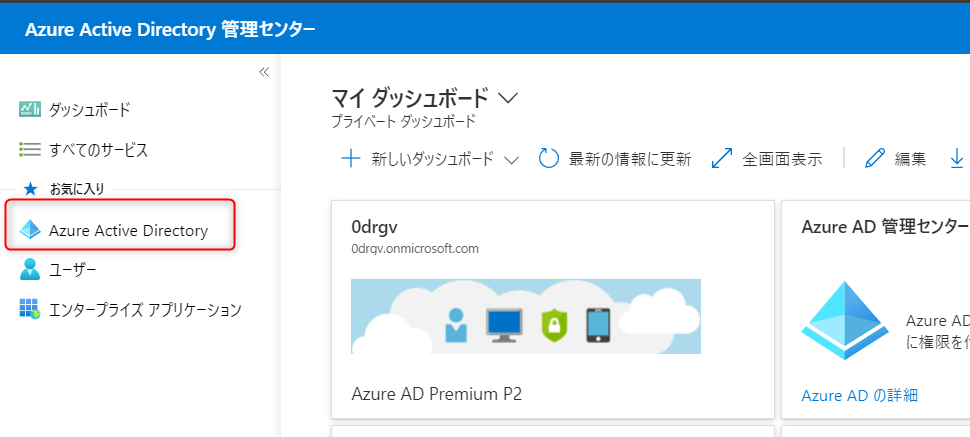
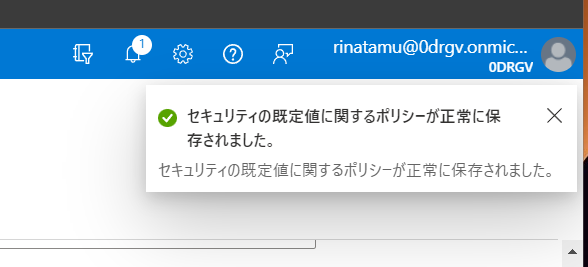

# アカウント保護の無効化方法

---

Microsoft 365 は、昨今の不正アクセスを増加を鑑み、新規に環境（テナント）を作成した場合は、このような形で、多要素認証の登録を促すようになっています。

実運用環境では、必ず対処しておきたいところではありますが、開発者プログラムの場合は邪魔になる場合もありますので、このアカウント保護の設定を無効化する方法を以下に記載します。

1. [Azure Active Directory](https://aad.portal.azure.com/) にアクセスします。

URL:[https://aad.portal.azure.com/](https://aad.portal.azure.com/)

2. 管理者ユーザーを入力し、「次へ」をクリックします。

3. パスワードを入力して、「サインイン」をクリックします。

4. アカウントの保護にご協力くださいの画面で、「今はしない」をクリックします。

5. サインインの状態を維持しますかで「はい」をクリックします。

6. 何度かアカウントの保護にご協力くださいの画面が表示される時がありますが、「今はしない」をクリックします。

7. Azure Active Directory 管理センターが表示されます。

8. 左メニューから、「Azure Active Directory」をクリックします。

9. 更に「プロパティ」をクリックします。

10. テナントのプロパティ画面が表示されますので、「セキュリティの規定値の管理」をクリックします。

11. 右に、セキュリティの規定値の有効化設定画面が表示されますので、「いいえ」をクリックします。

12. 理由を聞かれますので、適当なものを選択します。

13. 「保存」をクリックします。

14. セキュリティの既定値に関するポリシーが正常に保存されましたと表示されれば、設定は完了です。

