# Microsoft 365 開発者プログラム 登録方法

---

Microsoft 365 の開発者プログラムは、Microsoft 365 E5 相当のライセンスを、25ユーザー分、開発目的に利用することができます。

90日間利用することができ、90日毎に利用状況を審査され、問題なければ、更に90日間自動延長されます。
審査に落ちた場合は、その時点で終了となり、環境が消えてしまいます。

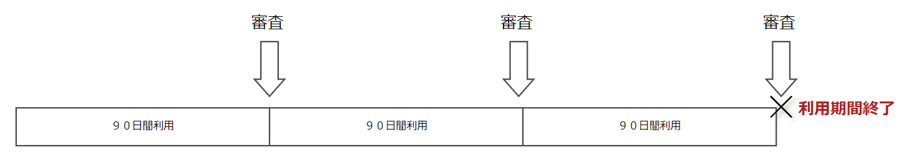

ですので、開発目的での利用に限って使用しましょう。

## 前提条件

Microsoft 365 開発者プログラムを登録するには、Microsoft アカウントが必要です。

お持ちでない方は、以下のURLからアクセスして、作成しましょう。

URL:https://outlook.live.com/owa/

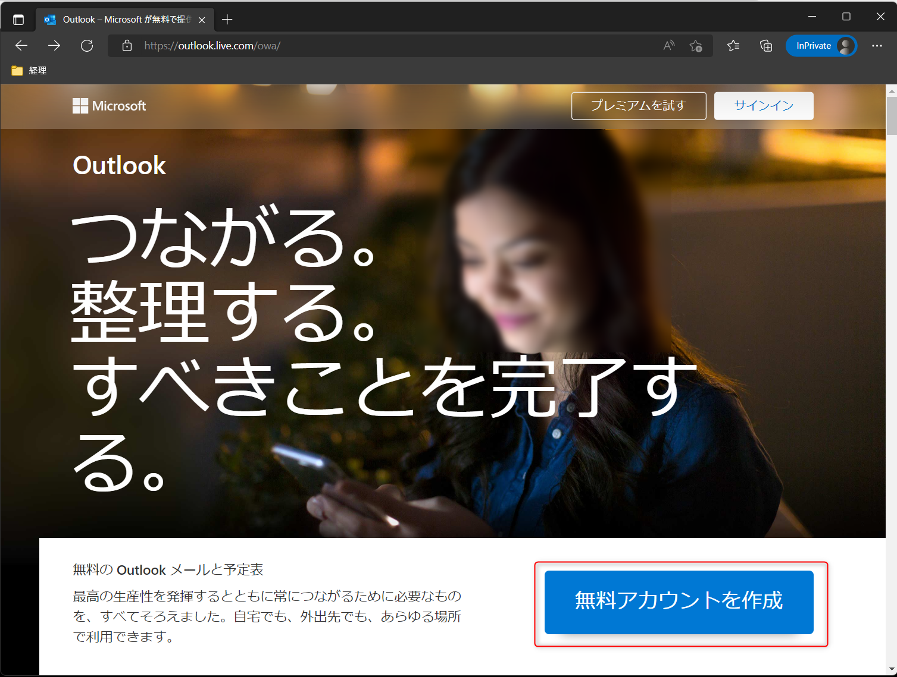

## 作成手順

1. [Microsoft 365 開発者プログラム](https://developer.microsoft.com/ja-jp/microsoft-365/dev-program)にアクセスします。

URL:https://developer.microsoft.com/ja-jp/microsoft-365/dev-program

2. 「今すぐ参加」をクリックします。

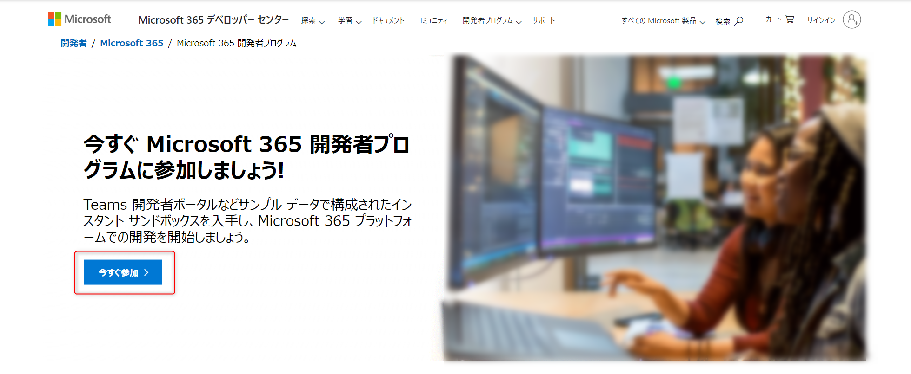

3. Microsoft アカウントを使ってサインインします

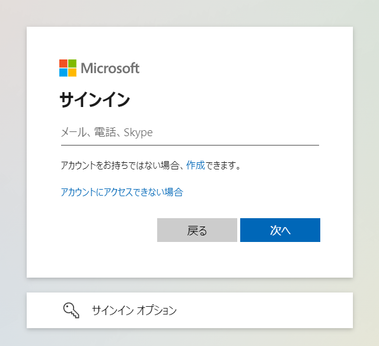

4. 国・地域 /会社名 / 言語設定 をそれぞれ入力します

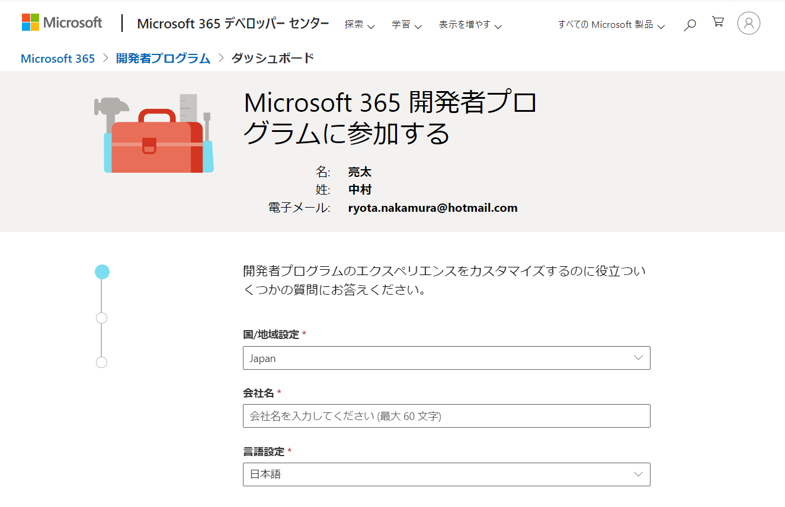
※会社名は適当で大丈夫です。

5. 契約条件を確認し、問題なければチェックを入れます。

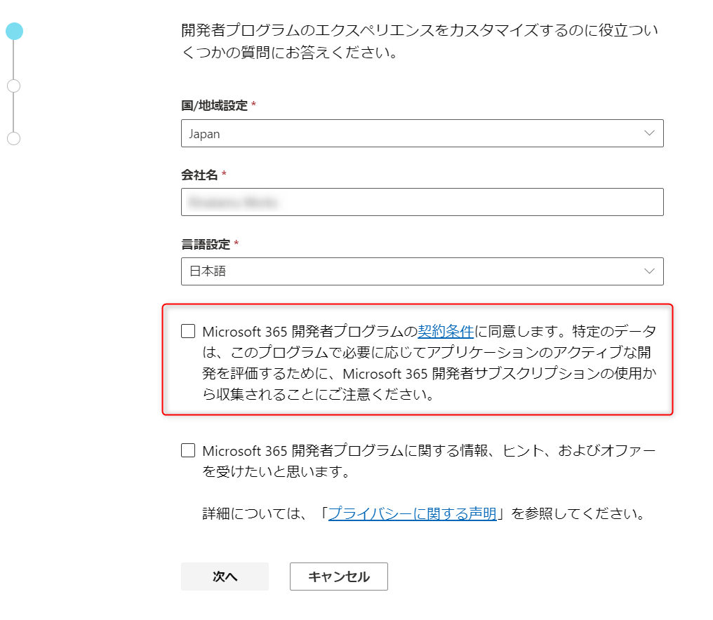

6. 「次へ」をクリックします。

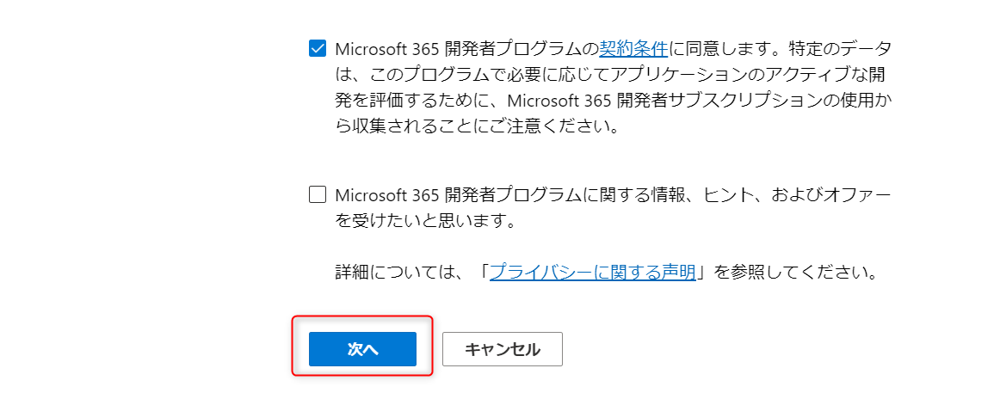

7. 開発者としての主な目的を選択し、「次へ」をクリックします。

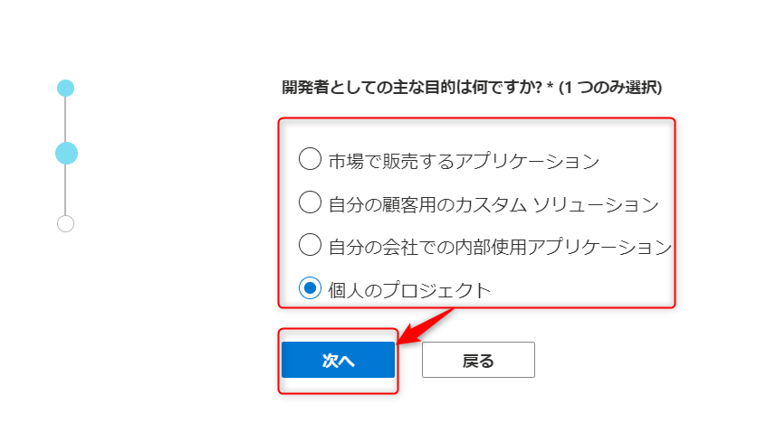

8. 興味ある分野にチェックを入れ、「保存」をクリックします。

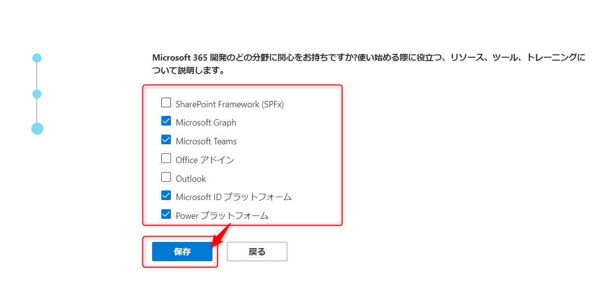

9. サンドボックスタイプを選択し、「次へ」をクリックします。

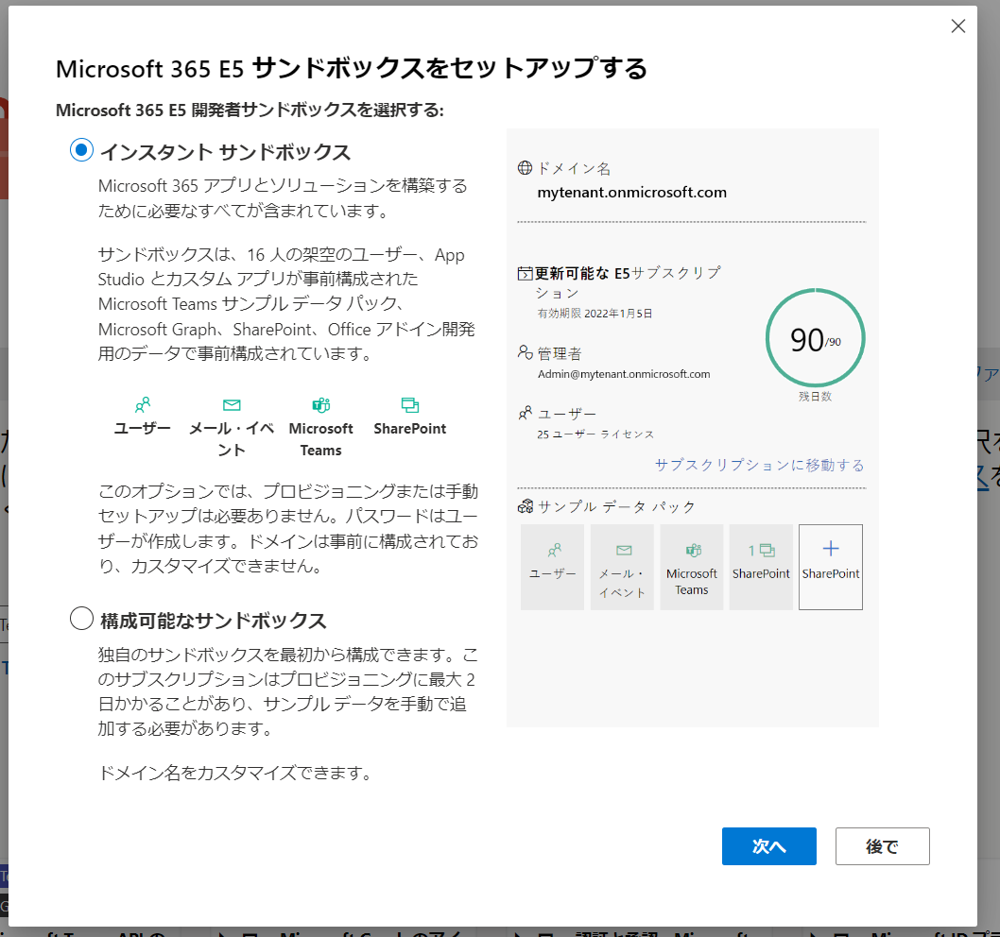

インスタントサンドボックスを選択した場合は、ランダムなドメインで作成され、サンプルデータなどが含まれます。
また、比較的早く作成されるので、学習には最適なタイプです。

構成可能なサンドボックスの場合は、ドメイン名を手動で指定することができますが、作成時間がかかるのとサンプルデータを自分で作る必要があります。

10. インスタントサンドボックスを選択した場合は、データセンターの場所、管理者ユーザー名、パスワードを指定し、「続行」をクリックします

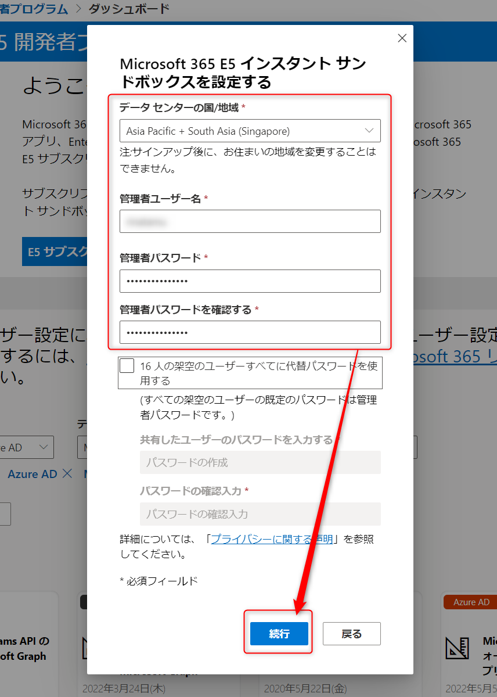

※架空ユーザーのパスワードを変えたい場合は、代替パスワードの使用にチェックを入れて、代替パスワードを指定してください。

11. 構成可能なサンドボックスを選択した場合は、国と、ユーザー名、ドメイン、パスワードを指定し、「続行」をクリックします。

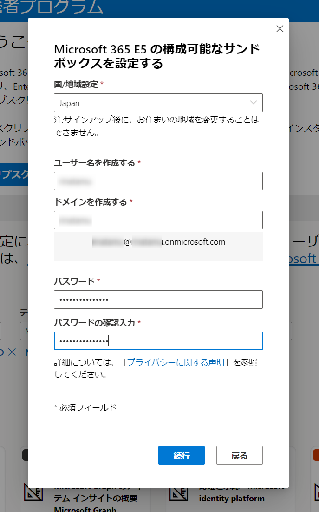

なお、ドメインは世界で一意（一つ）のものとなりますので、ほかのドメインがすでに使われているとこのように表示されます。

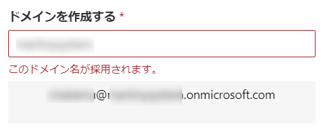

警告文が、一見すると使用できそうなニュアンスで表示されますが、続行ボタンが押せませんので使用できません。
ほかのドメイン名を指定してください。

12. 作成されると以下のようなメールをMicrosoft アカウントにて受信します。

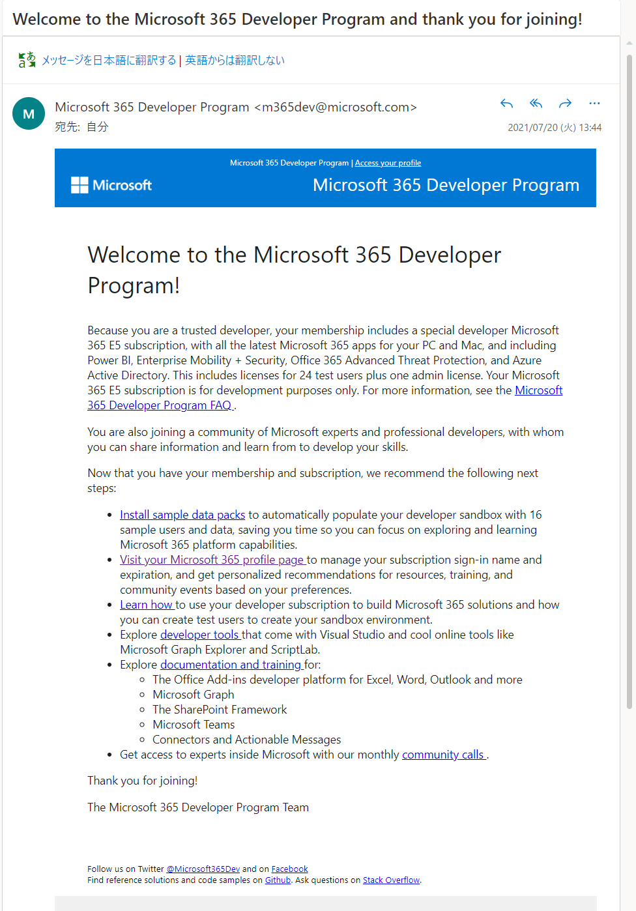

13. Visit your Microsoft 365 Profile page をクリックします

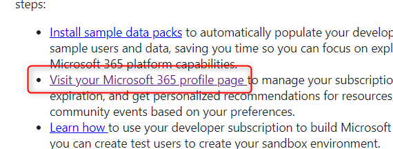

URL:https://developer.microsoft.com/ja-jp/microsoft-365/profile

14. 項番３で使用した Microsoft アカウントを使用してサインインします。

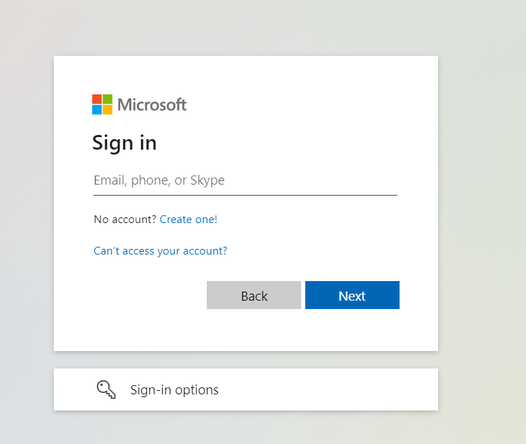

15. 作成したドメインが表示されていますので、「サブスクリプションに移動する」をクリックします

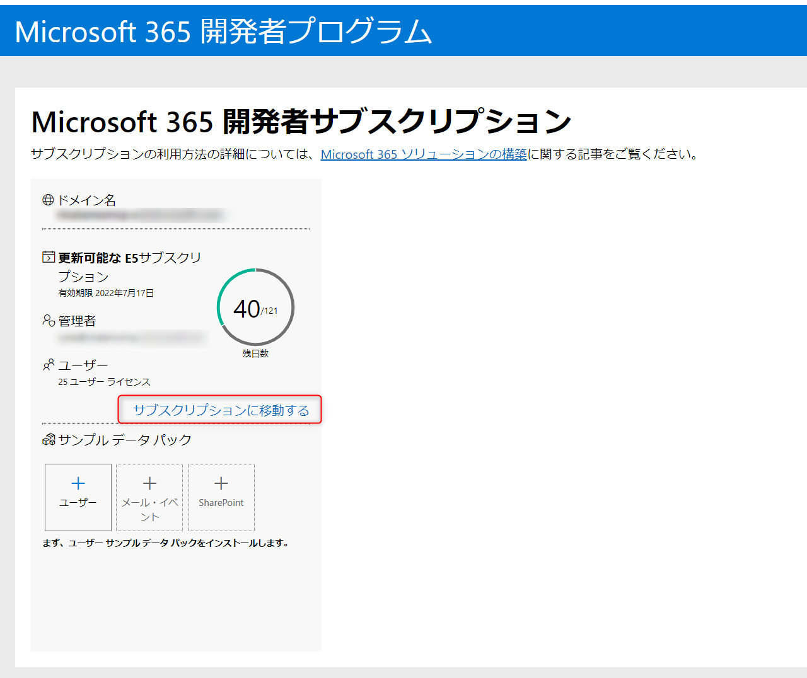

16. 項番10、項番11で指定したパスワードを使ってサインインします。

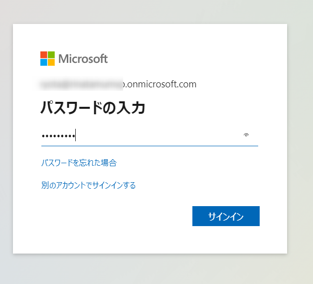

17. Microsoft 365 が使用できるようになります。

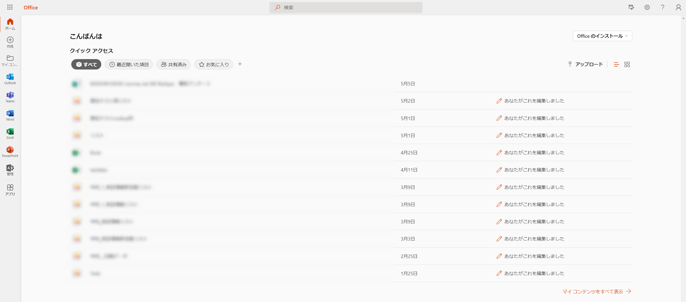

