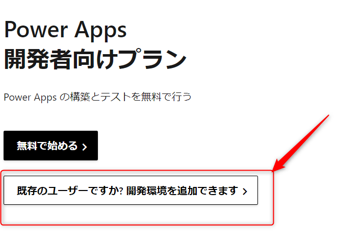
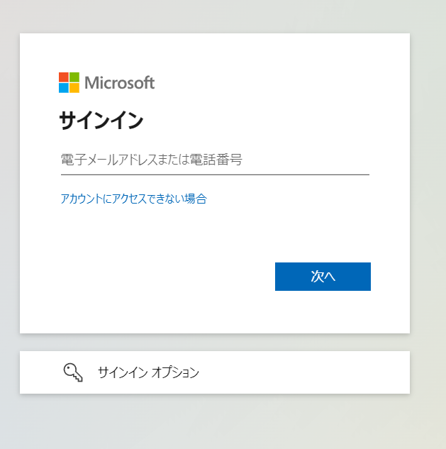
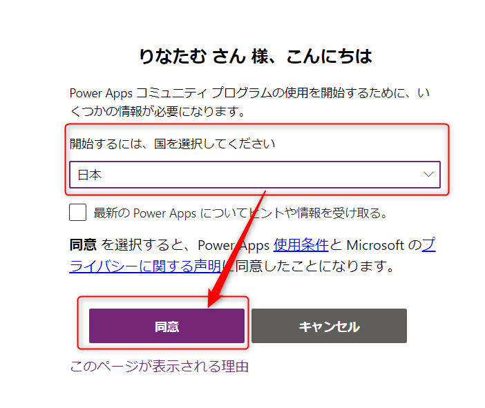
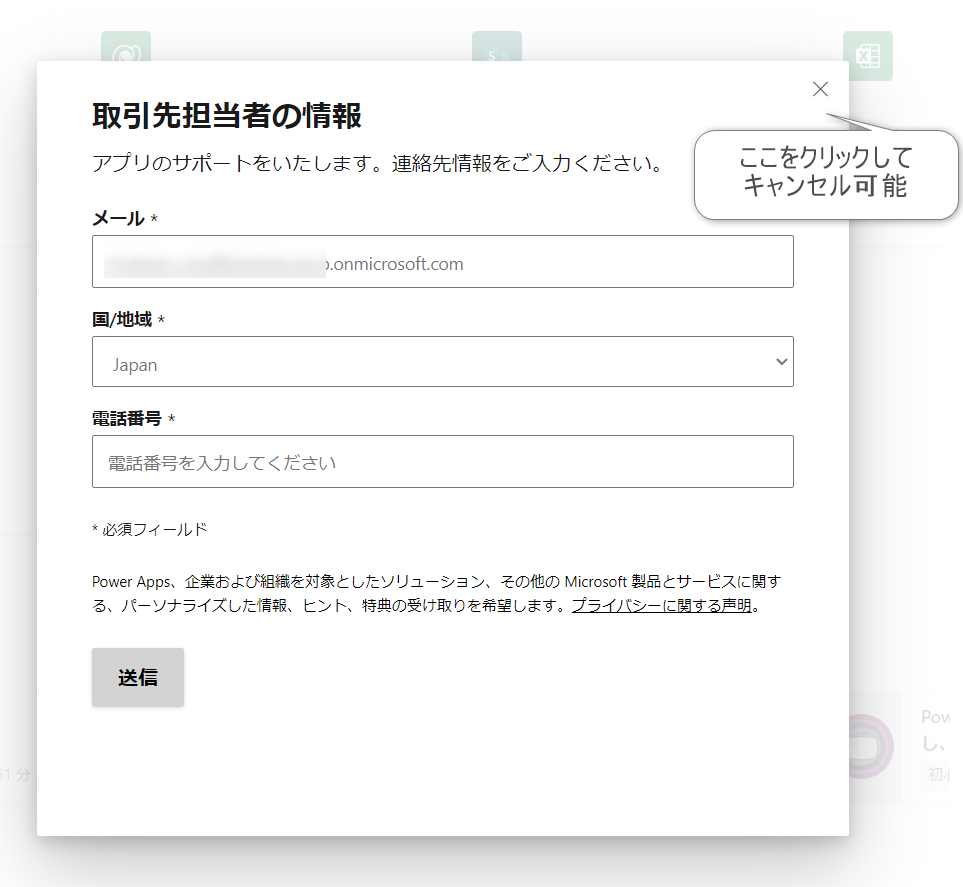
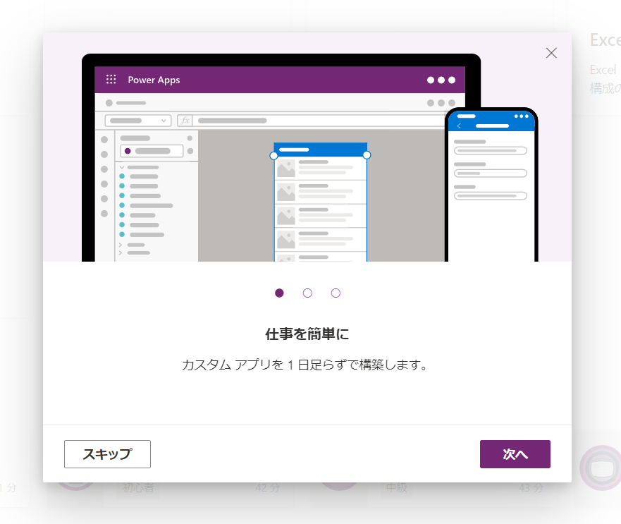
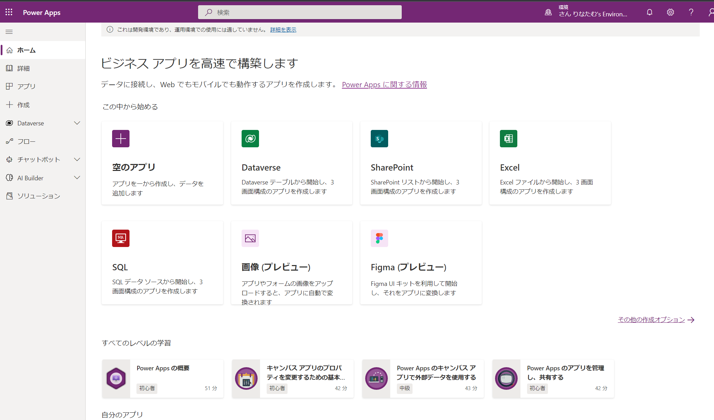
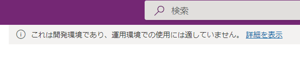
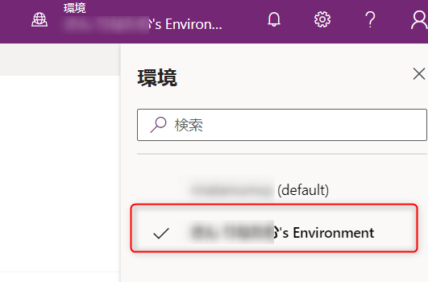

# Power Apps 開発者向けプラン 登録方法

---

Power Apps 開発者プランは、Power Apps 及び Power Automate の開発や学習目的として、有償機能の一部を無料で使用できるプランです。

利用できる有償機能は以下の通りです

* プレミアムコネクタを利用可能
* Microsoft Dataverse を使用可能（2GBまで）
* Power Automate Flowを750回/月実行可能

利用できない有償機能は以下の通りです

* AI Builder (ただし試用版を利用することは可能です)
* Power Automate for desktop の有償機能
* Power Pages (旧 Power Apps Portal)
* Power Platform Dataflow
* Power Virtual Agents の有償機能

## 前提条件

* Microsoft 365 のアカウントが必要です。
* Microsoft 365 管理者によっては使用を禁止されている可能性があるので確認が必要です。

Microsoft 365 開発者プログラムを使用していれば、その環境で適用することができます。
[作成手順](../1_Microsoft%20365/README.md)

## 作成手順

1. [Power Apps 開発者向けプラン](https://powerapps.microsoft.com/ja-jp/developerplan/)のサイトにアクセスします。

URL:https://powerapps.microsoft.com/ja-jp/developerplan/

2. 「既存のユーザーですか？」をクリックします。

3. Microsoft 365 のアカウントでサインインします。

4. 国を選択し、「同意」をクリックします。

5. 作成が完了すると、取引先担当者の情報が表示されるので、必要に応じて対処します。

6. 簡単なヘルプが表示されます。

7. 開発者向けプランの Power Apps 画面が表示されます。

この表示が出ていれば、開発者向けプランの環境です。

8. もし表示されていない場合は、右上の環境をクリックして、〇〇's Environment をクリックすると、開発者向けプランの環境に切り替えることができます。

