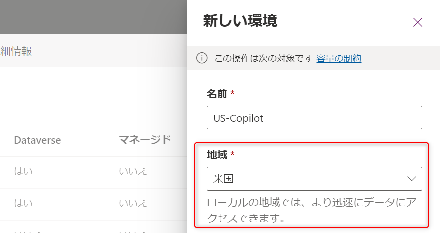
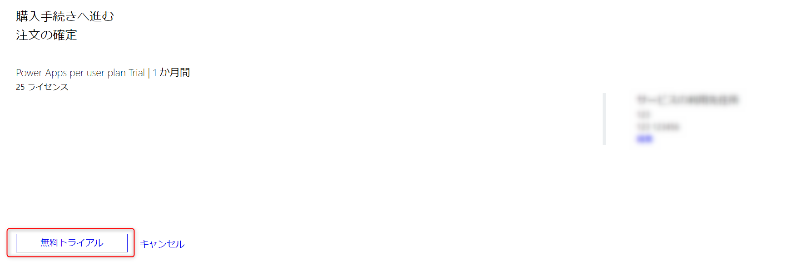

# 最新環境の作り方

---

Power Apps および Power Automate の最新機能をいち早く試すには、以下のリージョンの環境である必要があります。

* 米国
* プレビュー（米国）

本編では、Microsoft 365 開発者プログラム内での上記環境の作り方について解説しています。

## 前提条件

本手順を実行する際には、[Power Apps 開発者向けプラン](../2_Power%20Apps%20Developer%20Program/README.md)が登録済みである必要があります。

## 1. 米国環境の作り方

1. [Power Platform 管理者センター](https://admin.powerplatform.microsoft.com/)に入ります。

2. 「環境」をクリックします。

3. 「新規」をクリックします。

4. 新しい環境にて、適切な名前をつけ、地域を「米国」に設定します。

5. 種類を「開発者」に設定します。

6. Dataverse データストアを追加しますかにチェックが入っていることを確認し、「次へ」をクリックします。

7. 言語を「English(United States)」、通貨を「USD($)」に変更し、「保存」をクリックします。

8. 環境が作成されることを確認します。

## 2. プレビュー環境の作り方

プレビュー環境を使用する場合は、Power Apps / Power Automate 試用版のライセンスが必要になりますので、まずは試用版登録を行います。

### 2.1.  試用版ライセンスの登録方法

1. [Microsoft 365 管理者センター](https://admin.microsoft.com/)に入ります。

2. 「課金情報」から「サービスを購入する」をクリックします。

3. 「ビジネスアプリ」をクリックします。

4. Power Apps per user plan の「詳細」をクリックします。

5. 「無料試用の開始」をクリックします。

6. 必要な情報という画面が出てくる場合は、「続行」をクリックします。

→ 出てこない場合は項番11に飛びます

7. 課金アカウントの詳細画面で「編集」をクリックします。

8. 必須項目を全て埋めて「保存」をクリックします。

9. 販売先住所を編集しましたと表示されることを確認します。

10. もう一度項番５まで操作します。

11. 「無料トライアル」をクリックします。

12. 同様に 「Power Automate per user plan」の無料使用を開始します。

13. 管理センターに戻り、「ユーザー」から「アクティブなユーザー」をクリックします。

14. ライセンスを割り当てるユーザーをクリックします。

15. 「ライセンスとアプリ」をクリックします。

16. 追加されたライセンスにチェックを入れて、「変更の保存」をクリックします。

### 2.2.  プレビュー環境の作成

1. [Power Platform 管理者センター](https://admin.powerplatform.microsoft.com/)に入ります。

2. 「環境」をクリックします。

3. 「新規」をクリックします。

4. 新しい環境にて、適切な名前をつけ、地域を「プレビュー（米国）」に設定します。

5. 種類を「試用版」に変更し、「保存」をクリックします。

6. プレビュー環境が作成されることを確認します。

